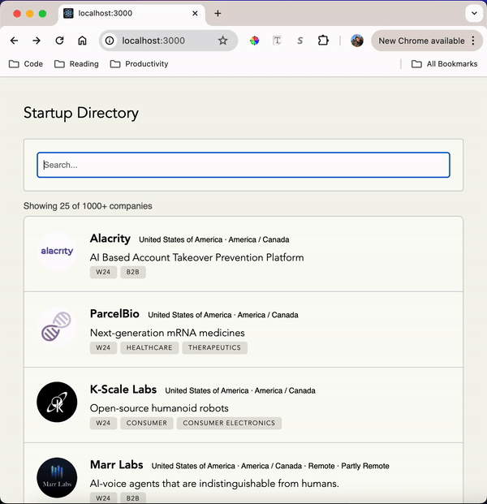
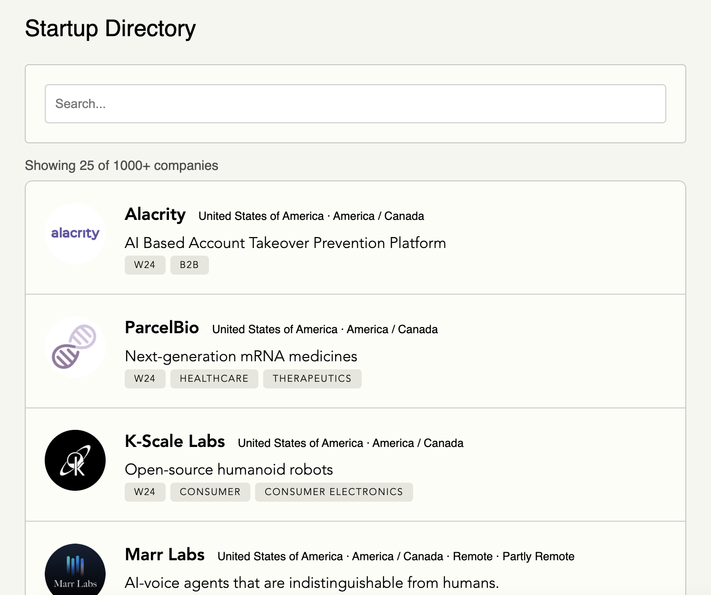
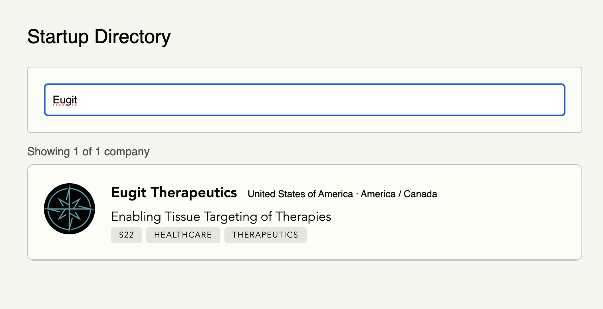
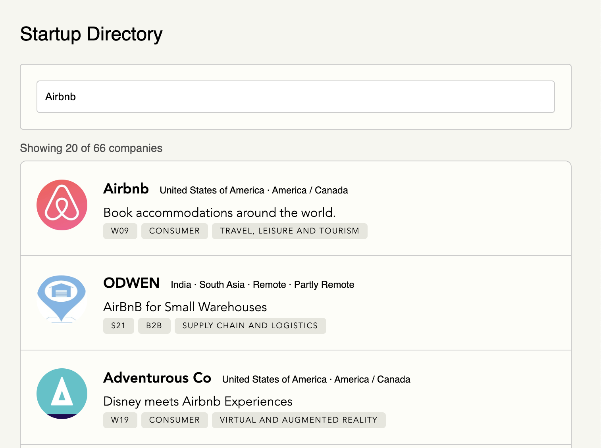
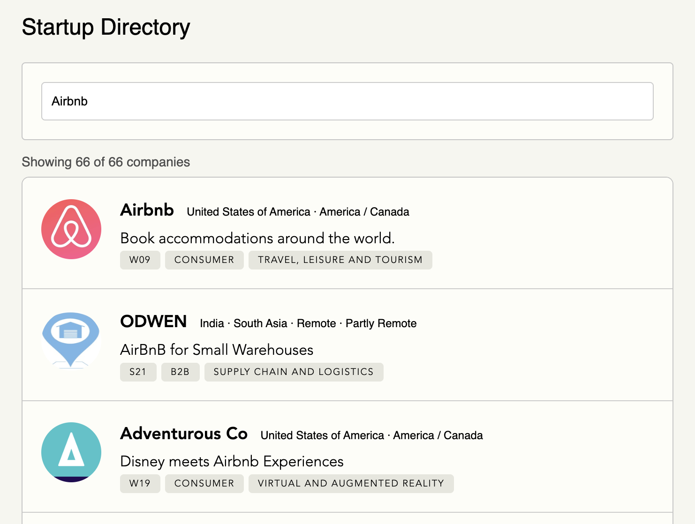

# YC Companies

## Instructions
To create the project: `npx create-react-app yc`   

To run the local server:

```
cd yc
npm start
```

## Features
- Pagination. On every "Load More" button click, requests the next page of results. 
- Search bar. On every change, it will create a new query to /companies.
- Message. Displays the number of companies loaded / number available. 

## Known issues
- [Message] There's a lag in Y value for the "Showing the X of Y companies". This is because the API does not return the total number of results, so the current implemntation makes second request to get the number of results on the last page. An alternative could be changing this to "Y+" where Y = the total pages * number of results on the first request if it is not the last page.
- [Pagination] I *think* something is refetching the data in the back. The current implementation ignores the refetched data, so the duplicates aren't added to the list. In the future, you would probably want to fix it so there is no stale data.
- [Search] It does not maintain state on a refresh. To fix this, I could store the query param in local storage.

## Demo


### Screenshots

#### Initial page result


#### Single result


#### Loading query
query="Airbnb"



